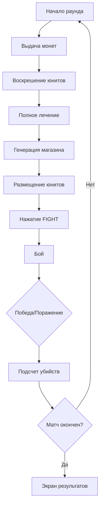

# 🛠️ Руководство для разработчиков

Этот документ содержит информацию для разработчиков, которые хотят понять или модифицировать код игры.

## 📋 Архитектура

### Основные системы

```
GameScene (главная сцена)
├── GridSystem (управление сеткой)
├── BattleSystem (логика боя)
└── EconomySystem (экономика)
```

### Классы юнитов

```
Unit (базовый класс)
├── Archer (лучник)
├── Warrior (мечник)  
├── Barbarian (варвар)
├── Healer (лекарь с лечением)
└── Mage (маг с мульти-таргетом)
```

## 🎮 Жизненный цикл раунда



## 💰 Экономическая система

### Формула дохода
```javascript
income = BASE_REWARD + KILLS_LAST_ROUND
// BASE_REWARD = 5 монет
// KILLS_LAST_ROUND = количество убитых врагов в прошлом раунде
```

### Пример
- Раунд 1: стартовый капитал = 10 монет
- Убито 4 врага → сохранено в `enemiesKilledLastRound`
- Раунд 2: доход = 5 + 4 = 9 монет

## 🎯 Добавление нового юнита

### Шаг 1: Добавить в gameConfig

```javascript
UNIT_TYPES: {
    NEW_UNIT: {
        name: 'Новый юнит',
        size: { width: 1, height: 1 },
        cost: 3,
        hp: 40,
        damage: 10,
        attackSpeed: 1.0,
        range: 10,
        color: 0xFF00FF
    }
}
```

### Шаг 2: Создать класс юнита

```javascript
class NewUnit extends Unit {
    constructor(scene, gridX, gridY, isEnemy = false) {
        super(scene, gridX, gridY, isEnemy, 
              { width: 1, height: 1 }, 
              0xFF00FF);
        
        this.maxHp = 40;
        this.hp = this.maxHp;
        this.damage = 10;
        this.attackSpeed = 1.0;
        this.range = 10;
        
        // Опционально: добавить способность
        // this.hasTaunt = true; // Провокация (как у Варвара)
        
        this.updateVisuals();
    }

    updateVisuals() {
        if (this.sprite) {
            this.sprite.setFillStyle(this.color);
            if (this.isEnemy) {
                this.sprite.setFillStyle(0x666666);
            }
        }
    }
    
    // Опционально: переопределить attack() для особых механик
    // Пример: Варвар с провокацией, Маг с мульти-таргетом, Лекарь с лечением
}
```

### Шаг 3: Добавить в placeUnit()

```javascript
case 'NEW_UNIT':
    unit = new NewUnit(this, gridX, gridY);
    break;
```

### Шаг 4: Добавить в spawnEnemies()

```javascript
const unitTypes = [
    { type: 'ARCHER', data: UNIT_TYPES.ARCHER },
    { type: 'NEW_UNIT', data: UNIT_TYPES.NEW_UNIT }, // Добавить
    // ...
];

// И в switch
case 'NEW_UNIT':
    enemy = new NewUnit(this, x, y, true);
    break;
```

### Шаг 5: Добавить иконку в магазине

```javascript
createShopCards(shopY) {
    // ...
    if (type === 'NEW_UNIT') {
        this.add.circle(x, shopY - 20, 12, 0xFF00FF);
        // Или другая визуализация
    }
}
```

## 🔧 Основные методы

### GridSystem

| Метод | Описание |
|-------|----------|
| `createGrid()` | Создает визуальную сетку |
| `canPlaceUnit()` | Проверяет можно ли разместить юнита |
| `placeUnit()` | Размещает юнита на сетке |
| `getGridPosition()` | Конвертирует мировые координаты в сетку |
| `getWorldPosition()` | Конвертирует сетку в мировые координаты |

### BattleSystem

| Метод | Описание |
|-------|----------|
| `startBattle()` | Запускает бой |
| `updateBattle()` | Обновляется каждые 100мс |
| `processAttacks()` | Обрабатывает атаки юнитов |
| `findNearestTarget()` | Ищет ближайшую цель |
| `endBattle()` | Завершает бой |

### GameScene

| Метод | Описание |
|-------|----------|
| `init()` | Сбрасывает переменные при рестарте |
| `create()` | Создает игровые объекты |
| `selectUnit()` | Выбирает юнита из магазина |
| `placeUnit()` | Размещает юнита на поле |
| `startBattle()` | Начинает бой |
| `endBattle()` | Завершает раунд |
| `prepareNextRound()` | Подготовка к следующему раунду |
| `resurrectUnits()` | Воскрешает и лечит юнитов |
| `checkMatchEnd()` | Проверяет окончание матча (Bo5) |
| `endGame()` | Завершает матч |

## 🎨 Константы и настройки

### Размеры сетки
- `GRID_WIDTH: 8` - ширина поля
- `GRID_HEIGHT: 6` - высота поля
- `CELL_SIZE: 50` - размер клетки в пикселях
- `PLAYER_AREA_HEIGHT: 3` - рядов для игрока
- `ENEMY_AREA_HEIGHT: 3` - рядов для врага

### Правила матча
- `maxRounds: 5` - максимум раундов
- `winsNeeded: 3` - побед для победы

### Экономика
- `STARTING_COINS: 10` - стартовый капитал
- `baseReward: 5` - монет за новый раунд
// Уточнение: бонусы за убийства могут отсутствовать в текущей версии

## 🐛 Отладка

### Полезные логи

```javascript
// В консоли браузера
console.log('=== НАЧАЛО БОЯ ===');
console.log('Юнитов игрока:', this.playerUnits.length);
console.log('Счет матча:', playerWins, '-', enemyWins);
```

### Проверка состояния

```javascript
// Текущий раунд
console.log(this.currentRound);

// История раундов
console.log(this.roundResults); // [true, false, true] = В-П-В

// Монеты
console.log(this.economySystem.getCoins());
```

## 📱 Адаптация для мобильных

### Текущие настройки

```javascript
const config = {
    width: 480,
    height: 900,
    scale: {
        mode: Phaser.Scale.FIT,
        autoCenter: Phaser.Scale.CENTER_BOTH
    }
};
```

### Рекомендации
- Используйте крупные кликабельные области (минимум 44x44px)
- Избегайте hover эффектов
- Тестируйте на реальных устройствах
- Используйте `pointer` события вместо `mouse`

## 🚀 Оптимизация

### Производительность

1. **Avoid в update()**
   - Не используйте update() для размещения юнитов
   - Используйте события: `once('pointerdown')`

2. **Tweens cleanup**
   - Всегда уничтожайте graphics после анимации
   - Используйте `killTweensOf()` перед новой анимацией

3. **Object pooling**
   - Рассмотрите переиспользование объектов
   - Особенно для частиц и эффектов

## 📝 Стиль кода

### Именование
- Классы: `PascalCase`
- Методы: `camelCase`
- Константы: `UPPER_SNAKE_CASE`
- Приватные поля: `_camelCase` (условно)

### Комментарии
```javascript
// Однострочный комментарий для простых объяснений

/**
 * Многострочный JSDoc комментарий
 * для классов и важных методов
 */
```

## 🔮 Планируемые улучшения

1. **Разделение на модули**
   - Разбить game.js на отдельные файлы
   - Использовать ES6 modules

2. **TypeScript**
   - Добавить типизацию для безопасности

3. **Unit tests**
   - Тесты для GridSystem
   - Тесты для BattleSystem

4. **State management**
   - Централизованное управление состоянием

5. **Asset loader**
   - Загрузка реальных спрайтов
   - Звуки и музыка

## 📚 Полезные ссылки

- [Phaser 3 Documentation](https://photonstorm.github.io/phaser3-docs/)
- [Phaser 3 Examples](https://phaser.io/examples)
- [Auto-battler Genre Guide](https://en.wikipedia.org/wiki/Auto_battler)

---

Если у вас есть вопросы, изучите код с комментариями или откройте Issue на GitHub.

